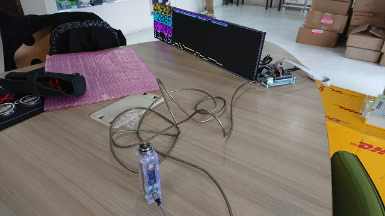
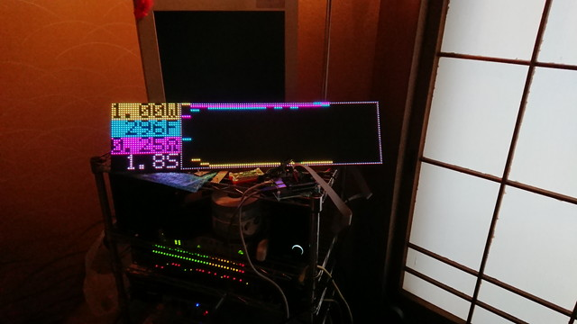

Control demo of evolv DNA Series by Python
===
evolv DNAシリーズを、Raspberry Piを使って情報取得を行い、LEDパネルに表示するデモです。

電力や温度などを、ほぼリアルタイムに表示することができます。



<a href="README_IMAGE/anime.gif">アニメーション例</a>

また、コマンドラインインターフェースによる、デモ実装も提供しております。

動作概要は、以下ブログをご参照下さい。
http://ecig.eucaly.net/archives/22850349.html

(C) SATO Keiichi. [eucalyptus.] <kei@eucaly.net>, licensed with
[GNU General Public License Version 2.0](http://www.gnu.org/licenses/gpl-2.0.txt)

対応ハードウェア
---
- Raspberry Pi (複数コアのもの)
- [Adafruit RGB MATRIX HAT](https://www.adafruit.com/product/2345)
- 32x64 LEDパネル 2枚 (HUB75接続のもの)
- 赤外線受光部 ([秋月 OSRB38C9BX-W150CM](http://akizukidenshi.com/catalog/g/gM-08628/)を使用しました)
- Apple Remote (A1156)

ソフトウェア概要
---
- Python 2.7 系列対応
- rckickのみperl
- pyserial使用

ファイル | 概要
---|---
image|フォントやタイトル画像ディレクトリ
lirc|赤外線リモコン制御定義ディレクトリ
systemd|サービス登録用定義ディレクトリ
dnainfoconnect.py|DNA接続用クラススクリプト
dnainfodemo.py|コマンドラインデモ用スクリプト
dnainfoledrender.py|LED表示用クラススクリプト
dnainfoloader.py|サービスキック用スクリプト
dnainfomain.py|メインルーチンスクリプト
dnainfotitle.py|待機時・タイトル用スクリプト
rckick|リモコンキック用スクリプト

セットアップは、「[SETUP.md](./SETUP.md)」をご参照下さい。


使い方
---
サービス起動後、DNAを接続すると、以下のグラフ画面になります。


リモコンの「上下ボタン」で、機能が切り替わります。

モジュールモード


標準偏差モード


消費電力モード


バッテリー内部抵抗値予測モード


グラフモードでは、パフ時間に応じ、グラフの時間軸が変化します。

1.2秒以内


2.4秒以内


4.8秒以内


リモコンの「左右ボタン」で、最大１０回分のパフ履歴を表示します。

３つ前


４つ前


リモコンの「中央ボタン」で、現在のパフを表示します。


リモコンの「MENUボタン」で、DNAが報告する電力と、電流、電圧から計算した電力を切り替えます。

DNA報告電力


計算電力


コンソールデモ用スクリプト
---
LED用サービスを停止している状態で、「dnainfodemo.py」を起動することで、コンソールにて動作します。
```
6.81W  285.86F  1.285V  4.965A  0.252ohm  BAT: 3.87V  MEAS WATT: 6.380025W
6.47W  285.01F  1.246V  4.916A  0.252ohm  BAT: 3.88V  MEAS WATT: 6.125336W
6.84W  283.87F  1.349V  5.255A  0.252ohm  BAT: 3.87V  MEAS WATT: 7.088995W
7.37W  283.88F  1.359V  5.207A  0.252ohm  BAT: 3.86V  MEAS WATT: 7.076313W
7.67W  285.25F  1.335V  5.037A  0.253ohm  BAT: 3.86V  MEAS WATT: 6.724395W
```

いろいろ
---
試してみて下さいな！。

